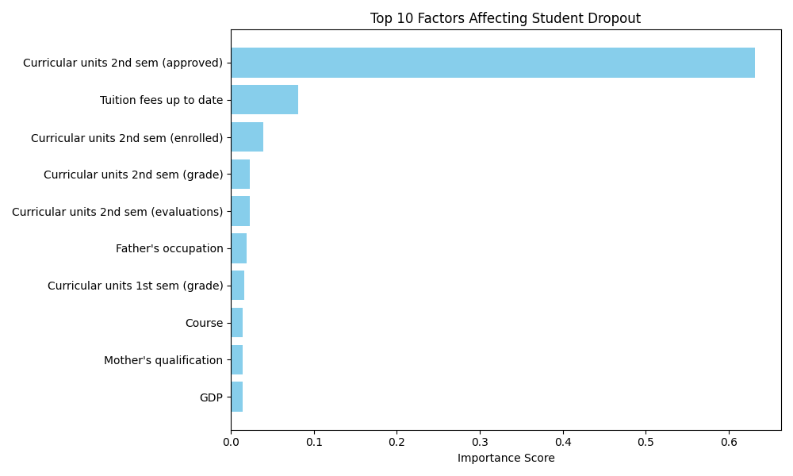
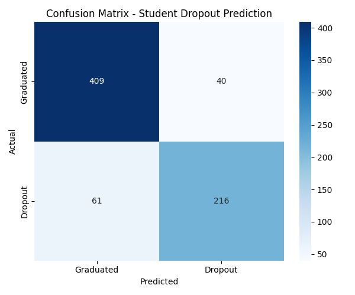
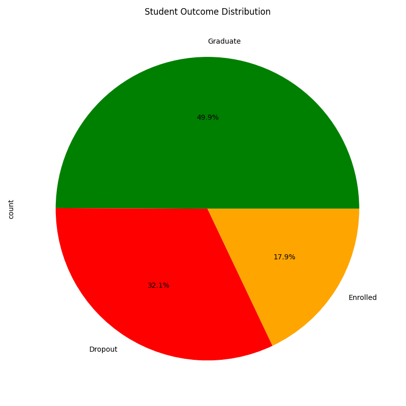

# Student Dropout Predictor

A machine learning model that predicts student dropout risk using Random Forest — achieving 89% accuracy on real educational data.

## Overview

1 in 3 students in this dataset dropped out before completing their degree. This project builds a machine learning model to identify at-risk students early — giving institutions the chance to intervene before it is too late.

## Results

| Metric | Score |
|--------|-------|
| Model accuracy | 89.12% |
| Dropout precision | 90% |
| Graduate precision | 89% |
| Training samples | 2,904 |
| Testing samples | 726 |

## Key Finding

Second semester academic performance is the strongest predictor of dropout. Students who fail to complete second semester units are significantly more likely to leave before graduating.

## Charts

### Top 10 Factors That Predict Dropout


### Confusion Matrix


### Student Outcome Distribution


## How to Run

```bash
git clone https://github.com/Paddu2006/student-dropout-predictor.git
cd student-dropout-predictor
pip install pandas scikit-learn matplotlib seaborn
python dropout.py
```

## Tech Stack
Python, Pandas, Scikit-learn, Random Forest, Matplotlib, Seaborn

## What I Learned
- How to train a Random Forest classifier on real educational data
- How feature importance reveals what drives an outcome
- How machine learning can support real social interventions in education

## License
MIT License
